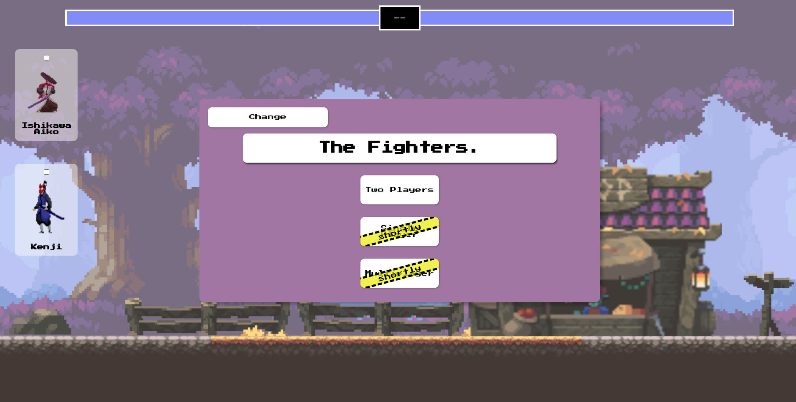

# **The Fighter Game**

## Table of contents

- [Overview](#overview)
  - [Screenshot](#screenshot)
  - [Links](#links)
- [My process](#my-process)
  - [Built with](#built-with)
- [Author](#author)

## Overview

### Screenshot



### Links

- Live Site URL: [Add live site URL here](https://eu-pedro0ficial.github.io/The-Fighter-Game/)

## My process

### Built with

- Semantic HTML5 markup;
- CSS custom properties;
- Javascript;
- Flexbox;
- Game design;
- Object oriented programming;
- Web responsive design.

## Author

- Instagram - [ohpedro0ficial](https://instagram.com/ohpedro0ficial?igshid=ZDdkNTZiNTM=)
- Credits - [Chris Courses](https://www.youtube.com/watch?v=vyqbNFMDRGQ&t=2s)

## How to run the local project ?

- First install the used packages
```
  ~$npm install
```
- Run the project locally
```
  ~$npm run dev
```
